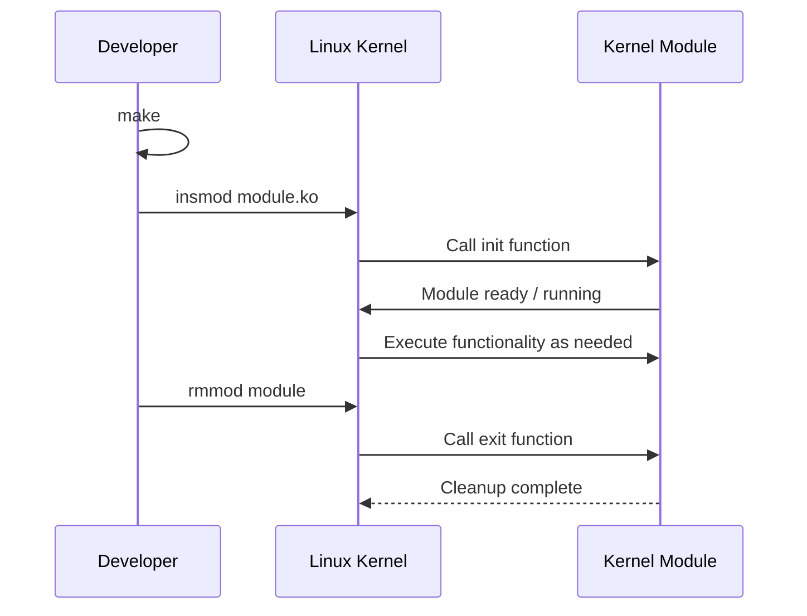
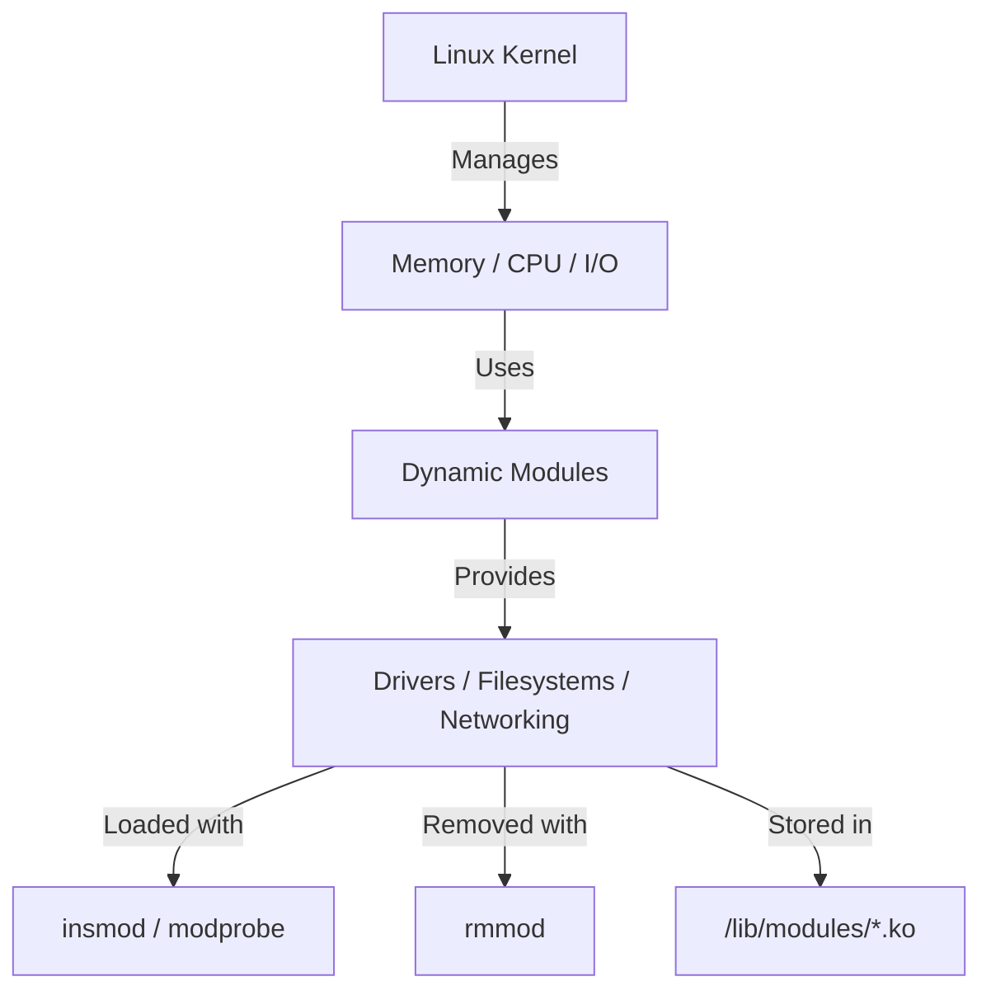

# Explore Kernel Modules

## Definition of a Kernel Module

A Linux kernel module is a piece of software that can be:

*   loaded into the kernel during its execution,
*   unloaded when it is no longer needed.

It is an extension of the kernel compiled separately. Its binary file has the **.ko** (Kernel Object) extension.

A module is a bit like a "plugin" for the kernel.

**Examples:**

*   USB driver → `usb_storage.ko`
*   Network driver → `e1000.ko`
*   File system module → `ext4.ko`

## 3. Advantages of Modules

| Advantage      | Description                                                    |
| :------------- | :------------------------------------------------------------- |
| **Modularity** | Add functionality without recompiling the entire kernel.     |
| **Flexibility**  | Drivers can be loaded/unloaded on the fly ("hot-plug").      |
| **Maintenance**  | A faulty module can be removed without rebooting.             |
| **Optimization** | Only necessary modules are present in memory.                |

## 4. Types of Modules

1.  **Device driver modules**
    → Manage interactions with hardware (network cards, disks, etc.).
2.  **File system modules**
    → Allow the use of different formats (ext4, ntfs, nfs...).
3.  **Network modules**
    → Provide network protocols and layers (ipv6, netfilter...).
4.  **Security / firewall modules**
    → Control security and filters (ip_tables, xt_recent...).

## 5. Location of Modules

Modules are stored in:

`/lib/modules/$(uname -r)/`

Each sub-directory corresponds to a category:

`/lib/modules/6.8.0-26-generic/kernel/drivers/`
`/lib/modules/6.8.0-26-generic/kernel/fs/`
`/lib/modules/6.8.0-26-generic/kernel/net/`

`uname -r` gives you the kernel version:

```bash
$ uname -r
6.8.0-26-generic
```

## 6. Main Commands for Module Management

| Command | Description                            | Example                       |
| :------ | :------------------------------------- | :---------------------------- |
| `lsmod` | Lists currently loaded modules         | `lsmod`                       |
| `insmod`| Manually loads a module (.ko file)     | `sudo insmod my_module.ko`    |
| `rmmod` | Unloads a module                       | `sudo rmmod my_module`        |

**Example:**

```bash
$ lsmod | grep usb
usb_storage    57344 1
usbhid         57344 0
```

This means that:
*   the `usb_storage` module is loaded (for USB keys),
*   and `usbhid` is loaded for USB input devices (keyboard/mouse).

## 7. Structure of a Simple C Module

**Example: hello.c**

```c
#include <linux/module.h> // Required for all modules
#include <linux/kernel.h> // For KERN_INFO
#include <linux/init.h>   // For the __init and __exit macros

MODULE_LICENSE("GPL");
MODULE_AUTHOR("Chafik");
MODULE_DESCRIPTION("Simple kernel module: Hello World");

static int __init hello_init(void)
{
    printk(KERN_INFO "Hello, Kernel World!\n");
    return 0;
}

static void __exit hello_exit(void)
{
    printk(KERN_INFO "Goodbye, Kernel World!\n");
}

module_init(hello_init);
module_exit(hello_exit);
```

## 8. Compiling the Module

Create a `Makefile`:

```makefile
obj-m += hello.o

all:
    make -C /lib/modules/$(shell uname -r)/build M=$(PWD) modules

clean:
    make -C /lib/modules/$(shell uname -r)/build M=$(PWD) clean
```

Then execute:

```bash
make
sudo insmod hello.ko
dmesg | tail
sudo rmmod hello
```

**Journal output:**

```
[ 120.456789 ] Hello, Kernel World!
[ 135.456890 ] Goodbye, Kernel World!
```

## 9. Information about the Module

To display the details:

```bash
modinfo hello.ko
```

**Example output:**

```filename:       /home/chafik/hello.ko
license:        GPL
author:         Chafik
description:    Simple kernel module: Hello World
srcversion:     8C3A27E...
vermagic:       6.8.0-26-generic SMP mod_unload
```

## 10. Removing a Module

To remove it:

```bash
sudo rmmod hello
```

Then verify:

```bash
lsmod | grep hello
```

No output = the module was successfully removed ✔

## 11. Security and Permissions

*   Only **root** can load or remove a module.
*   The **Secure Boot** system can block unsigned modules.
*   Some modules can cause **instability** if they modify critical kernel structures.

## 12. Lifecycle of a Module



## 13. Checking the Logs

All module messages appear in the **system journal**:

```bash
dmesg | tail -n 10
```

## Global Summary

| Element             | Description                                           |
| :------------------ | :---------------------------------------------------- |
| **Definition**      | Dynamic extension of the Linux kernel                 |
| **Extension**       | .ko (kernel object)                                   |
| **Language**        | C                                                     |
| **Compilation**     | via `make` and the kernel headers                     |
| **Key commands**    | `insmod`, `rmmod`, `modprobe`, `lsmod`, `modinfo`     |
| **Typical example** | Device driver                                         |
| **Main advantage**  | Dynamic addition/removal of features without a reboot |

## Summary Diagram


